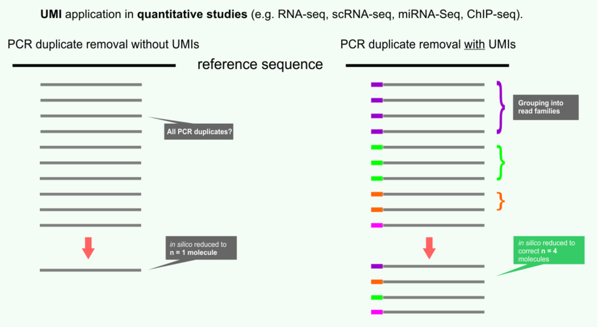
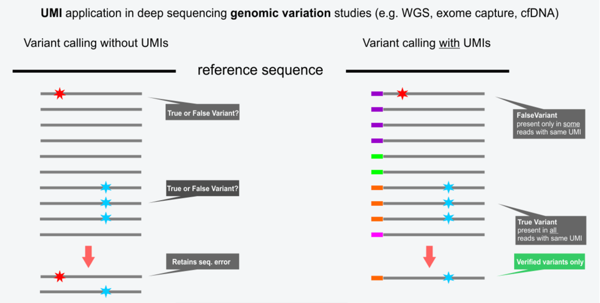

# What are Unique Molecular Identifiers? 

Unique Molecular Identifiers, or UMIs for short, are molecular barcodes which can be added to the sequences within a sequencing library before PCR amplification. 

UMIs are useful because PCR amplification, which is often required before sequencing, could introduce biases that would be impossible to detect otherwise. For example, certain sequences could have unique properties that make them more likely to amplify which would make accurate quantification difficult. Other methods have been introduced to remove these biases (i.e., de-duplication protocols), but they are usually not as efficient as UMIs. 

The figure below illustrates how adding a UMI can help us quantify the actual number of times a particular sequence was encountered.

Another use case for UMIs is accurate variant detection. Note that PCR amplification is not perfect, and amplification could introduce variants which could be called in downstream analysis as “real” variants. 

That is, data without UMIs cannot distinguish between sequencing errors and variants, but by adding a UMI prior to amplification we can determine whether the variant is real. For example, if all the reads in a “read family” (i.e., same UMI barcode) have the same variant then it is likely real. 

Library prep typically requires a PCR amplification step which has the potential to introduce bias (especially for longer sequences, sequences with a high amount of GC content, and if you have low amounts of starting material)

References

https://dnatech.genomecenter.ucdavis.edu/faqs/what-are-umis-and-why-are-they-used-in-high-throughput-sequencing/

